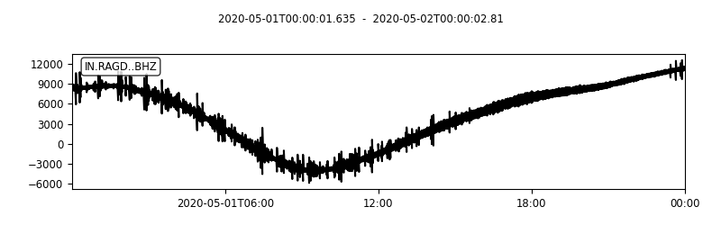

# Python utility program to convert mseed file to mat 
- by Utpal Kumar, IESAS, 2021/04
- matlab script to read the mat data and analyze

## Installation

### Using Anaconda/Miniconda
```
conda create -n earthinversion
conda activate earthinversion
conda install -c conda-forge obspy
```

### Using venv
```
python -m venv earthinversion
source earthinversion/bin/activate
pip install obspy
```

### Usage
type `python convert_mseed_mat.py -h`

```
usage: convert_mseed_mat.py [-h] -inp INPUT_MSEED [-out OUTPUT_MAT]

Python utility program to convert mseed file to mat (by Utpal Kumar, IESAS, 2021/04)

optional arguments:
  -h, --help            show this help message and exit
  -inp INPUT_MSEED, --input_mseed INPUT_MSEED
                        input mseed file, e.g. example_2020-05-01_IN.RAGD..BHZ.mseed
  -out OUTPUT_MAT, --output_mat OUTPUT_MAT
                        output mat file name, e.g. example_2020-05-01_IN.RAGD..BHZ.mat
```

### Example
```
python convert_mseed_mat.py -inp example_2020-05-01_IN.RAGD..BHZ.mseed
```




